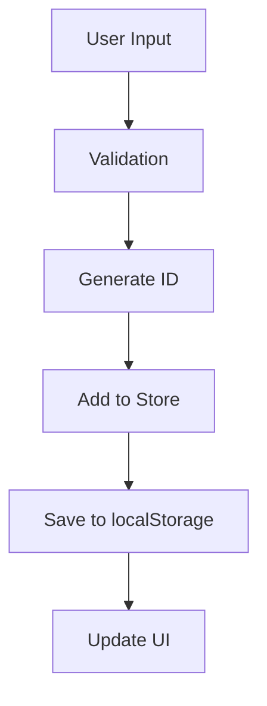
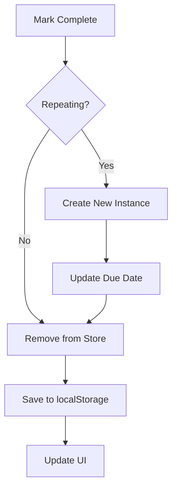

# Technical Specifications

## Project Requirements

### Functional Requirements

#### Task Management Core
- **F1**: Users can create tasks with title, description, due date, priority, and labels
- **F2**: Users can edit all task properties after creation
- **F3**: Users can delete tasks permanently
- **F4**: Users can mark tasks as complete, removing them from active view
- **F5**: Users can set tasks to repeat on daily, weekly, monthly, or yearly intervals
- **F6**: Completed repeating tasks automatically generate new instances

#### Task Organization
- **F7**: Tasks are automatically grouped by due date (Today, Upcoming, Overdue, No Due Date)
- **F8**: Users can manually reorder tasks within each group via drag-and-drop
- **F9**: Task groups can be collapsed or expanded
- **F10**: Users can filter tasks by priority, label, or date range
- **F11**: Users can sort tasks by due date, priority, creation date, or manual order

#### User Interface
- **F12**: Application provides both list and calendar views
- **F13**: Calendar view displays tasks on their respective due dates
- **F14**: Users can switch between views without losing context
- **F15**: Task creation is available via quick-add input or detailed modal
- **F16**: All task properties are editable through modal interface

#### Data Persistence
- **F17**: All task data is stored locally in browser localStorage
- **F18**: Data persists across browser sessions
- **F19**: No external server or database required
- **F20**: Application works completely offline

### Non-Functional Requirements

#### Performance
- **NF1**: Initial page load time under 2 seconds on 3G connection
- **NF2**: Task operations (create, edit, delete) complete within 100ms
- **NF3**: Smooth drag-and-drop interactions at 60fps
- **NF4**: Calendar view renders efficiently for months with 100+ tasks

#### Usability
- **NF5**: Interface is intuitive for users without training
- **NF6**: All features accessible via keyboard navigation
- **NF7**: Responsive design works on mobile devices (320px+)
- **NF8**: Clear visual hierarchy and consistent design language

#### Reliability
- **NF9**: Data integrity maintained across browser sessions
- **NF10**: Graceful error handling for localStorage failures
- **NF11**: No data loss during unexpected browser closures
- **NF12**: Consistent behavior across supported browsers

#### Security
- **NF13**: No data transmission to external servers
- **NF14**: XSS protection through React's built-in safeguards
- **NF15**: Input validation prevents malformed data

## Technical Architecture

### Frontend Stack
```typescript
// Core Dependencies
{
  "react": "^18.2.0",
  "react-dom": "^18.2.0",
  "typescript": "^5.2.2",
  "zustand": "^4.4.7"
}

// UI and Styling
{
  "@dnd-kit/core": "^6.1.0",
  "@dnd-kit/sortable": "^8.0.0",
  "tailwindcss": "^3.3.6",
  "date-fns": "^2.30.0"
}

// Development Tools
{
  "vite": "^5.0.8",
  "eslint": "^8.55.0",
  "@typescript-eslint/parser": "^6.14.0"
}
```

### Data Model

#### Task Schema
```typescript
interface Task {
  id: string;              // Unique identifier (timestamp + random)
  title: string;           // Required task name (max 500 chars)
  description?: string;    // Optional description (max 2000 chars)
  dueDate?: string;        // ISO 8601 date string
  priority: 'Low' | 'Medium' | 'High';
  labels?: string[];       // Optional tags (max 10 labels)
  repeat?: 'Never' | 'Daily' | 'Weekly' | 'Monthly' | 'Yearly';
  completed: boolean;      // Completion status
  createdAt: string;       // ISO 8601 creation timestamp
  sortOrder: number;       // Manual ordering index
}
```

#### Storage Schema
```typescript
// localStorage key: 'task-tracker-tasks'
{
  "tasks": Task[],
  "version": "1.0.0",
  "lastModified": "2024-01-01T00:00:00.000Z"
}
```

### State Management

#### Store Structure
```typescript
interface TaskState {
  // Core Data
  tasks: Task[];
  
  // UI State
  filter: FilterOptions;
  sort: SortOptions;
  viewMode: 'list' | 'calendar';
  selectedTask: Task | null;
  isTaskModalOpen: boolean;
  
  // Actions
  setTasks: (tasks: Task[]) => void;
  addTask: (task: Omit<Task, 'id' | 'createdAt' | 'sortOrder'>) => void;
  updateTask: (id: string, updates: Partial<Task>) => void;
  deleteTask: (id: string) => void;
  completeTask: (id: string) => void;
  reorderTasks: (taskId: string, newIndex: number, section: string) => void;
  
  // Filtering & Sorting
  setFilter: (filter: FilterOptions) => void;
  setSort: (sort: SortOptions) => void;
  clearFilter: () => void;
  
  // UI Controls
  setViewMode: (mode: ViewMode) => void;
  setSelectedTask: (task: Task | null) => void;
  setTaskModalOpen: (open: boolean) => void;
  
  // Persistence
  loadFromStorage: () => void;
  saveToStorage: () => void;
}
```

## Implementation Details

### Component Architecture

#### Atomic Components
- **TaskRow**: Individual task display with interactions
- **TaskGroup**: Collapsible section wrapper
- **QuickAddTask**: Simple task creation input
- **FilterControls**: Filtering and sorting interface

#### Composite Components
- **TaskList**: Main list view with grouped tasks
- **Calendar**: Monthly calendar with task display
- **TaskModal**: Full task creation/editing interface
- **Header**: Application navigation and controls

#### Layout Components
- **App**: Root component with view routing
- **Main**: Content area container

### Data Flow

#### Task Creation Flow


#### Task Completion Flow


### Algorithms

#### Task Grouping Algorithm
```typescript
function groupTasksByDueDate(tasks: Task[]): GroupedTasks {
  const now = new Date();
  const groups = {
    today: [],
    upcoming: [],
    overdue: [],
    noDueDate: []
  };
  
  tasks.forEach(task => {
    if (!task.dueDate) {
      groups.noDueDate.push(task);
      return;
    }
    
    const dueDate = parseISO(task.dueDate);
    if (isPast(dueDate) && !isToday(dueDate)) {
      groups.overdue.push(task);
    } else if (isToday(dueDate)) {
      groups.today.push(task);
    } else {
      groups.upcoming.push(task);
    }
  });
  
  return groups;
}
```

#### Sort Algorithm
```typescript
function sortTasks(tasks: Task[], sortOptions: SortOptions): Task[] {
  const { by, direction } = sortOptions;
  
  return [...tasks].sort((a, b) => {
    let comparison = 0;
    
    switch (by) {
      case 'dueDate':
        comparison = compareDates(a.dueDate, b.dueDate);
        break;
      case 'priority':
        comparison = comparePriorities(a.priority, b.priority);
        break;
      case 'createdAt':
        comparison = new Date(a.createdAt).getTime() - new Date(b.createdAt).getTime();
        break;
      case 'manual':
        comparison = a.sortOrder - b.sortOrder;
        break;
    }
    
    return direction === 'asc' ? comparison : -comparison;
  });
}
```

### Performance Optimizations

#### Memoization Strategy
```typescript
// Expensive computations are memoized
const filteredTasks = useMemo(() => {
  return filterTasks(tasks, filterOptions);
}, [tasks, filterOptions]);

const sortedTasks = useMemo(() => {
  return sortTasks(filteredTasks, sortOptions);
}, [filteredTasks, sortOptions]);

const groupedTasks = useMemo(() => {
  return groupTasksByDueDate(sortedTasks);
}, [sortedTasks]);
```

#### Virtual Scrolling (Future)
For large task lists (1000+ tasks), implement virtual scrolling:
```typescript
interface VirtualScrollProps {
  items: Task[];
  itemHeight: number;
  containerHeight: number;
  renderItem: (item: Task, index: number) => React.ReactNode;
}
```

### Error Handling

#### localStorage Errors
```typescript
export const saveToStorage = (tasks: Task[]): void => {
  try {
    const data = JSON.stringify(tasks);
    localStorage.setItem(STORAGE_KEY, data);
  } catch (error) {
    if (error instanceof DOMException && error.code === 22) {
      // localStorage quota exceeded
      console.error('Storage quota exceeded');
      // Implement cleanup or user notification
    } else {
      console.error('Storage error:', error);
    }
  }
};
```

#### Component Error Boundaries
```typescript
class TaskErrorBoundary extends React.Component {
  constructor(props) {
    super(props);
    this.state = { hasError: false };
  }
  
  static getDerivedStateFromError(error) {
    return { hasError: true };
  }
  
  componentDidCatch(error, errorInfo) {
    console.error('Task component error:', error, errorInfo);
  }
  
  render() {
    if (this.state.hasError) {
      return <div>Something went wrong with this task.</div>;
    }
    
    return this.props.children;
  }
}
```

## Testing Strategy

### Unit Testing
```typescript
// Example test for utility function
describe('dateUtils', () => {
  test('isOverdue returns true for past dates', () => {
    const yesterday = new Date();
    yesterday.setDate(yesterday.getDate() - 1);
    
    expect(isOverdue(yesterday.toISOString())).toBe(true);
  });
  
  test('formatDueDate returns "Today" for today', () => {
    const today = new Date().toISOString();
    expect(formatDueDate(today)).toBe('Today');
  });
});
```

### Integration Testing
```typescript
// Example test for task creation flow
describe('Task Creation', () => {
  test('creates task with all properties', () => {
    const taskData = {
      title: 'Test Task',
      description: 'Test Description',
      dueDate: '2024-01-01T00:00:00.000Z',
      priority: 'High' as const,
      repeat: 'Weekly' as const
    };
    
    const { result } = renderHook(() => useTaskStore());
    
    act(() => {
      result.current.addTask(taskData);
    });
    
    expect(result.current.tasks).toHaveLength(1);
    expect(result.current.tasks[0]).toMatchObject(taskData);
  });
});
```

### E2E Testing
```typescript
// Example Playwright test
test('user can create and complete a task', async ({ page }) => {
  await page.goto('/');
  
  // Create task
  await page.fill('[data-testid="quick-add-input"]', 'Test Task');
  await page.click('[data-testid="add-task-button"]');
  
  // Verify task appears
  await expect(page.locator('[data-testid="task-row"]')).toBeVisible();
  
  // Complete task
  await page.click('[data-testid="task-checkbox"]');
  
  // Verify task is removed
  await expect(page.locator('[data-testid="task-row"]')).not.toBeVisible();
});
```

## Deployment Specifications

### Build Configuration
```typescript
// vite.config.ts
export default defineConfig({
  plugins: [react()],
  build: {
    outDir: 'dist',
    sourcemap: true,
    rollupOptions: {
      output: {
        manualChunks: {
          vendor: ['react', 'react-dom'],
          utils: ['date-fns', '@dnd-kit/core']
        }
      }
    }
  }
});
```

### Production Optimizations
- Tree-shaking for unused code elimination
- CSS purging with TailwindCSS
- Image optimization for any static assets
- Gzip compression for text assets
- CDN deployment for global distribution

### Browser Support Matrix
| Browser | Version | Features | Notes |
|---------|---------|----------|-------|
| Chrome | 88+ | Full support | Primary development target |
| Firefox | 78+ | Full support | Tested regularly |
| Safari | 14+ | Full support | iOS compatibility |
| Edge | 88+ | Full support | Chromium-based |

## Security Considerations

### Data Protection
- All data remains in browser localStorage
- No external API calls or data transmission
- No user authentication required
- XSS protection through React's built-in escaping

### Input Validation
```typescript
const validateTaskInput = (input: Partial<Task>): ValidationResult => {
  const errors: string[] = [];
  
  if (!input.title || input.title.trim().length === 0) {
    errors.push('Title is required');
  }
  
  if (input.title && input.title.length > 500) {
    errors.push('Title must be less than 500 characters');
  }
  
  if (input.description && input.description.length > 2000) {
    errors.push('Description must be less than 2000 characters');
  }
  
  if (input.dueDate && !isValidISODate(input.dueDate)) {
    errors.push('Invalid due date format');
  }
  
  return {
    isValid: errors.length === 0,
    errors
  };
};
```

## Accessibility Specifications

### WCAG 2.1 AA Compliance
- **Keyboard Navigation**: All interactive elements accessible via keyboard
- **Screen Reader Support**: Proper ARIA labels and semantic HTML
- **Color Contrast**: Minimum 4.5:1 ratio for normal text
- **Focus Management**: Visible focus indicators and logical tab order

### Implementation
```typescript
// Example accessible component
const TaskRow = ({ task }) => {
  return (
    <div
      role="listitem"
      aria-label={`Task: ${task.title}, Priority: ${task.priority}`}
      className="task-row"
    >
      <button
        aria-label={`Mark ${task.title} as complete`}
        onClick={() => completeTask(task.id)}
        className="task-checkbox"
      >
        {task.completed ? '✓' : '○'}
      </button>
      <span className="task-title">{task.title}</span>
    </div>
  );
};
```

This comprehensive technical specification provides the foundation for building, maintaining, and extending the Personal Task Tracker application.